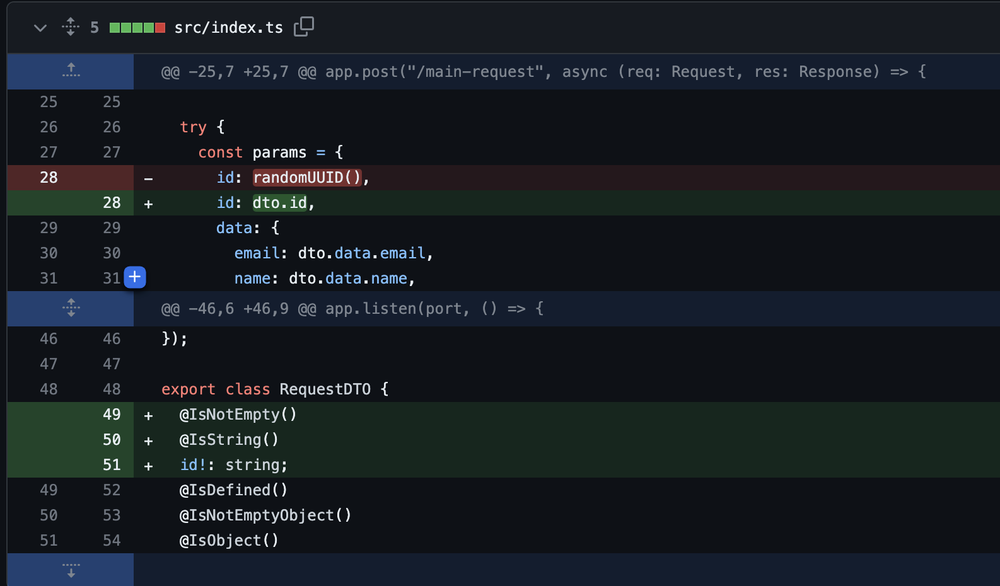
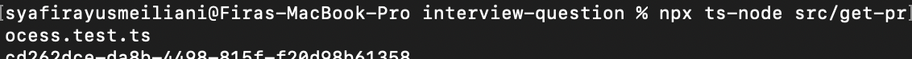
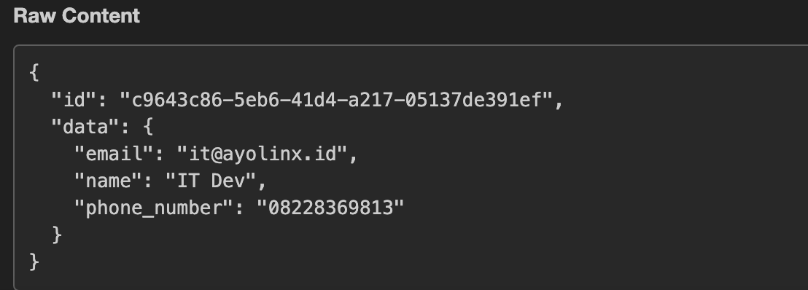
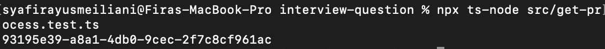
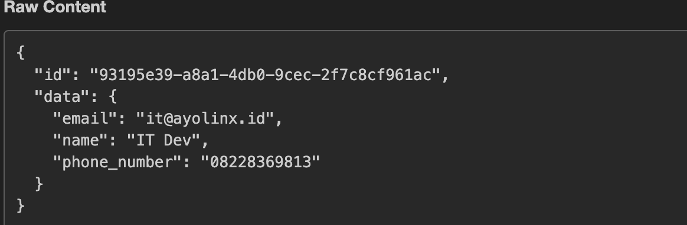

# Fullstack Coding Test

Instructions:
- Clone this repository.
- Go to https://webhook.site/
- Set-up our env
- running the server; npm run dev
- Test the endpoint with this command; npx ts-node src/get-process.test.ts
- Explain what the program does, if you find a bug, provide the solution.
- You can explain by add more line in this file. if you needed to modify the program, feel free.
- push this repo to your private repository and add our github account as colaborator when you finish your work.

1. The program receives a data request to be sent to webhook.site. Data in the form of ID, email, name, telephone number. Before the data sent to webhook.site, the request data is validated. There are 2 validated data, namely ID and data. Inside the data there are objects that are email, name and telephone number.
2. The ID received from the request is different from the ID sent to the webhook.site. Because the ID data received from the request is not used, but the program does a random UUID.
3. Validation is added for the ID property, and the ID property received from the request will be sent to webhook.site. So that the ID received from the request will be same as received by webhook.site. Validation takes the form of adding that the ID properties IsString, IsNotEmpty and required (id!)

